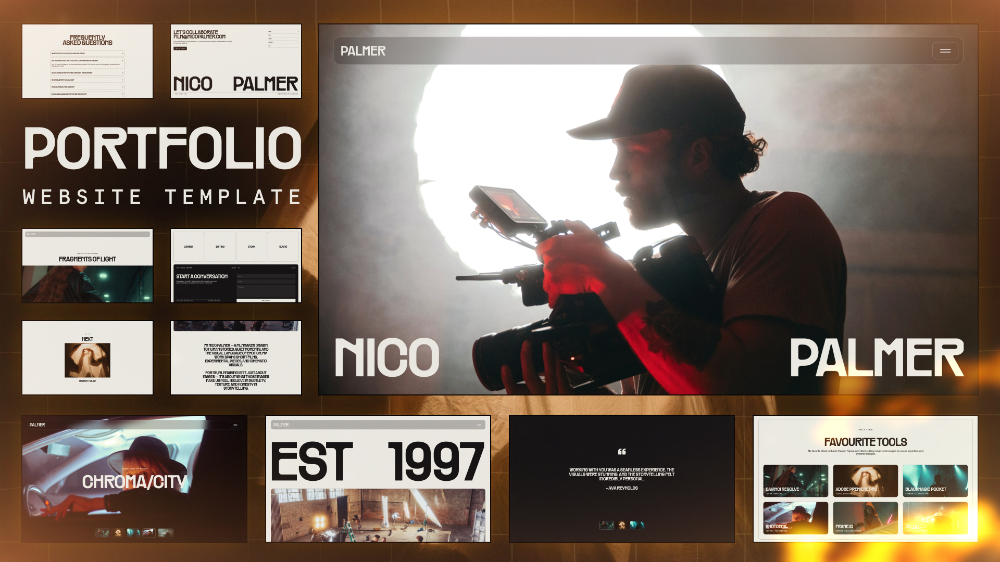

# Nico Palmer - Filmmaker Portfolio Template



## 🌟 [🔗 **LIVE DEMO**](https://website-template-05.vercel.app/) 🌟

**👆 Click above to see the template in action!**

A sophisticated filmmaker portfolio template built with React and Vite, featuring cinematic animations, modern design aesthetics, and professional presentation. Perfect for filmmakers, video producers, and creative professionals showcasing their visual work.

## ✨ Features

- **Cinematic Design**: Professional portfolio layout with film industry aesthetics
- **Smooth Animations**: Powered by GSAP and Framer Motion with custom transitions
- **Video Showcase**: Optimized video gallery and project presentation
- **Responsive Design**: Fully responsive layout optimized for all devices
- **Performance Optimized**: Built with Vite and React for lightning-fast loading
- **Interactive UI**: Smooth scrolling and engaging user interactions
- **Project Details**: Comprehensive project pages with specifications and credits
- **Contact Integration**: Professional contact forms and social media integration
- **Modern Navigation**: Intuitive navigation with smooth page transitions

## 🚀 Tech Stack

- **Framework**: React 19.0.0 with modern hooks
- **Build Tool**: Vite 6.2.0 for optimal performance
- **Animations**: GSAP 3.12.7 with @gsap/react integration
- **Motion**: Framer Motion 11.11.17 for advanced animations
- **Routing**: React Router 7.4.0 for seamless navigation
- **Smooth Scrolling**: Lenis 1.2.3 for buttery smooth scroll experience
- **Text Effects**: split-type 0.3.4 for typography animations
- **Icons**: Lucide React and React Icons for modern iconography
- **Styling**: Custom CSS with modern design principles

## 📦 Installation

1. Clone the repository:
```bash
git clone https://github.com/Alexey9911/website-template-05.git
```

2. Navigate to the project directory:
```bash
cd website-template-05
```

3. Install dependencies:
```bash
npm install
```

4. Run the development server:
```bash
npm run dev
```

5. Open http://localhost:5173 in your browser.

## 🔧 Available Scripts

- `npm run dev` - Start development server with hot reload
- `npm run build` - Build for production
- `npm run preview` - Preview production build locally
- `npm run lint` - Run ESLint for code quality

## 📁 Project Structure

```
nico-palmer/
├── public/
│   ├── fonts/
│   │   ├── messina-sans/
│   │   ├── messina-sans-mono/
│   │   └── rader/
│   ├── home/
│   ├── work/
│   ├── about/
│   ├── project/
│   └── image1.jpg
├── src/
│   ├── components/
│   │   ├── Header/
│   │   ├── Footer/
│   │   ├── Hero/
│   │   └── ProjectCard/
│   ├── pages/
│   │   ├── Home/
│   │   ├── Work/
│   │   ├── About/
│   │   └── Contact/
│   └── styles/
├── package.json
└── README.md
```

## 🎨 Customization

This template is designed to be easily customizable:

- **Content**: Update project information and portfolio pieces
- **Colors & Typography**: Modify CSS custom properties for brand consistency
- **Animations**: Adjust GSAP and Framer Motion configurations
- **Media**: Replace video and image assets with your own work
- **Layout**: Responsive grid system adapts to your content structure
- **Branding**: Update logo, contact information, and social media links

## 📱 Pages

- **Home (/)** - Hero section with featured work and introduction
- **Work (/work)** - Complete portfolio showcase with project filtering
- **About (/about)** - Personal story, skills, and professional experience
- **Contact (/contact)** - Contact form and professional information
- **Project Details (/project/:id)** - Individual project pages with full details
- **FAQ (/faq)** - Frequently asked questions about services

## 🎥 Portfolio Features

- **Video Integration**: Optimized video players and galleries
- **Project Showcase**: Detailed project presentations with specs
- **Client Testimonials**: Professional review and testimonial sections
- **Service Overview**: Clear presentation of filmmaking services
- **Equipment Showcase**: Professional gear and technical capabilities
- **Industry Experience**: Comprehensive work history and achievements

## 🌐 Live Demo & Deployment

### 🚀 [View Live Demo](https://website-template-05.vercel.app/)

See the template in action at: **https://website-template-05.vercel.app/**

### Deploy Your Own

This project is optimized for deployment on Vercel:

1. Push your code to GitHub
2. Connect your GitHub repository to Vercel
3. Vercel will automatically detect the build settings
4. Your site will be deployed with automatic updates on every push

[](https://vercel.com/new/clone?repository-url=https://github.com/Alexey9911/website-template-05)

### Manual Deployment Steps:

1. Build the project:
```bash
npm run build
```

2. Preview the build:
```bash
npm run preview
```

## 🎯 Performance Features

- Vite build optimization for fast loading
- Image optimization and lazy loading
- Code splitting and dynamic imports
- Smooth scroll performance with Lenis
- Efficient animation rendering with GSAP
- Modern React patterns and hooks
- Responsive image and video optimization

## 📄 License

This project is open source and available under the MIT License.

## 🤝 Contributing

Contributions, issues, and feature requests are welcome! Feel free to check the [issues page](https://github.com/Alexey9911/website-template-05/issues).

## ⭐ Show your support

Give a ⭐️ if this project helped you create an amazing filmmaker portfolio!

---

Built with ❤️ using React, Vite, GSAP, and modern web technologies.
